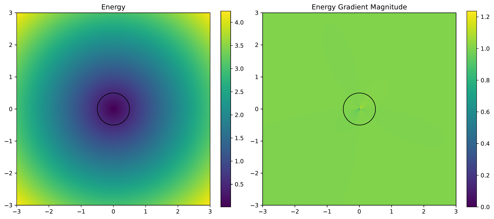
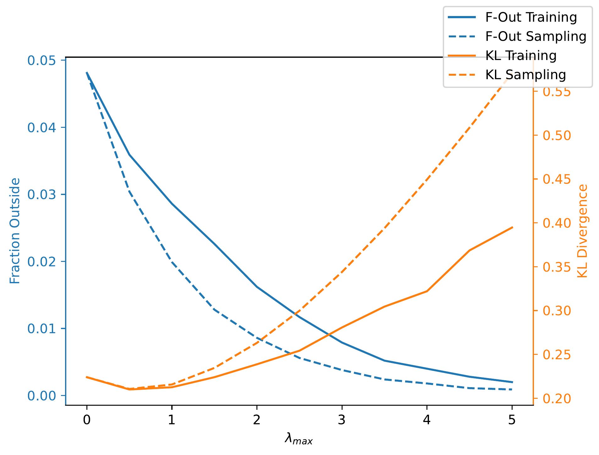
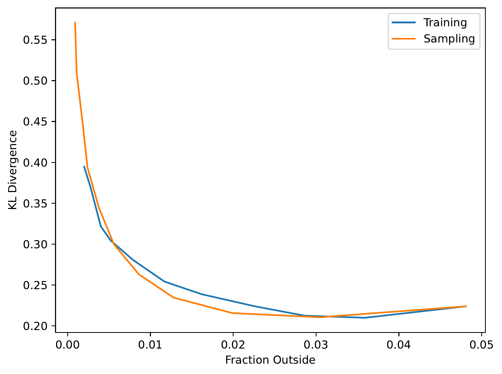
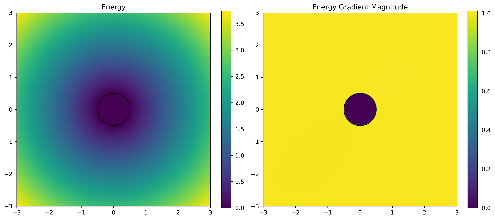
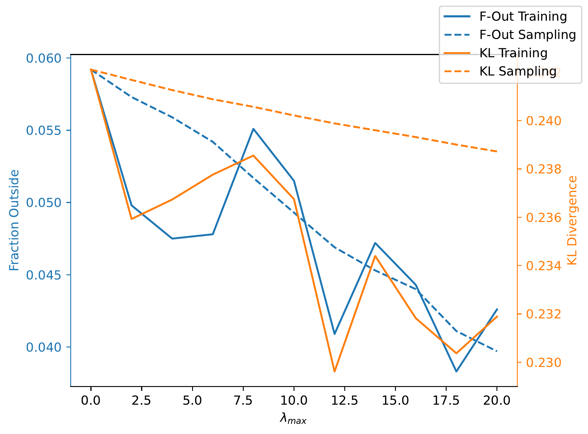
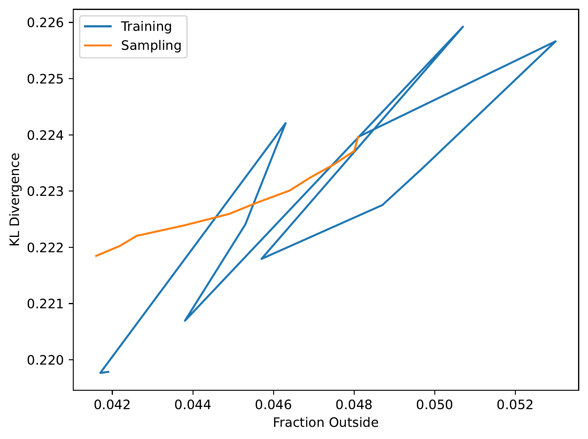
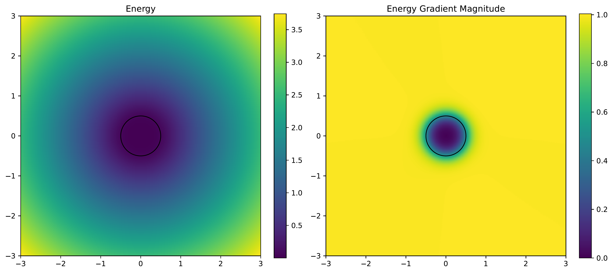
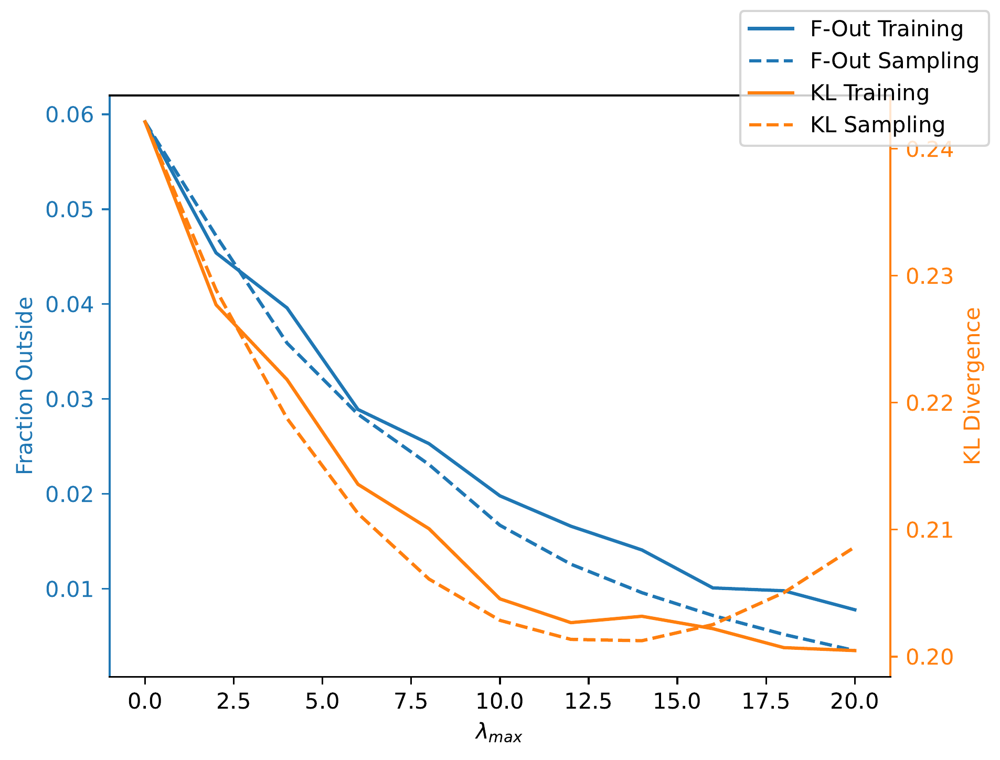
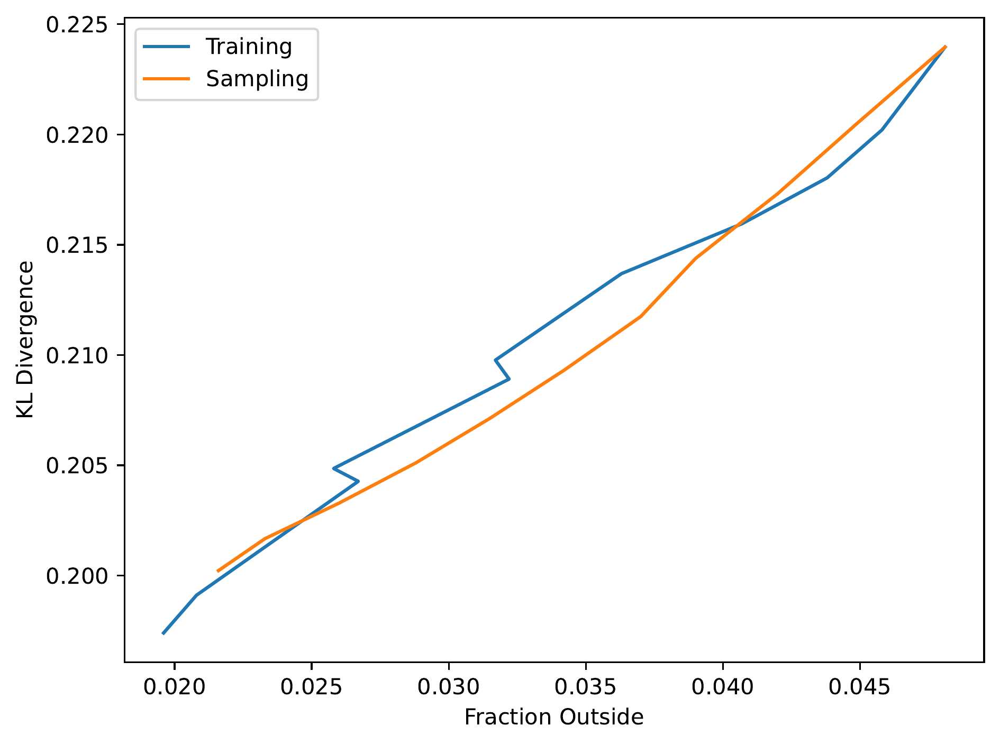

# Experiments

## Overview
- Learning a distribution $p_0(x \mid y)$ which is uniform circle centered at $y$ with radius $R$
- Use an energy function $E(x \mid y)$ to guide the samples into the circle boundary
- Exact score to sample from $p(x_0)e^{-\lambda E(x_0)}$ is:
$$\nabla_{x_t} \log{p_t(x_t)} + \nabla_{x_t} \log \mathbb{E}_{p(x_0 \mid x_t)} \left[ e^{-\lambda E(x_0)} \right]$$
- This term is intractable so approximate 
$$\mathbb{E}_{p(x_0 \mid x_t)} \left[ e^{-\lambda E(x_0)} \right] \approx e^{-\lambda E(\hat{x}_0)}$$
with
$$\hat{x}_0 = \frac{x_t - \sqrt{1-\bar{\alpha}}\ \epsilon_\theta(x_t, y, t)}{\sqrt{\bar{\alpha}}}$$
- Score becomes
$$\nabla_{x_t} \log{p_t(x_t)} - \lambda \nabla_{x_t}E(\hat{x}_0(x_t))$$

## Energy Functions
- Compare three energy functions

### Linear
- $E(x, y) = \lvert x - y \rvert$
- Does not define circle boundary, only distance to the centre of the circle

### ReLU
- $E(x, y) = \text{ReLU}(\lvert x - y \rvert - R)$
- Energy is zero within circle and increases linearly outside the boundary
- Non-differentiable at circle boundary

### Softplus
- $E(x, y) = \text{Softplus}(\lvert x - y \rvert - R)$
- Energy is approximately zero within the circle and increases linearly outside the boundary
- Smooth gradients 

## Experiment
- For each energy function, train models for different values of $\lambda$
- Calculate fraction of samples outside the circle, and estimate KL divergence

### Linear Energy

- There is a tradeoff between minimising KL divergence and the fraction of samples outside the boundary
- The energy function has no information abouth the circle boundary, only the centre, so points are compressed towards the centre of the circle and lose the uniform distribution
- It is hard to compare applying the gradients during training verses sampling here, as they clearly have different sensitivity to $\lambda$

- This plot of KL divergence against fraction outside shows the inverse relationship and removes the $\lambda$ dependence
- If one method was preferred over another the curve would be closer to the bottom left

### ReLU Energy
- Since we want a uniform distribution within the circle, the energy should be constant within the circle too
- Using ReLU achieves this but introduces a discontinuity in the gradients at the circle boundary

- Here we see that both fraction outside and KL divergence decrease together, for both training and sampling. Since there are no energy gradients within the circle, we might expect it to become more uniform
- In the case of sampling, the KL and fraction outside decrease smoothly with $\lambda$ as the gradients calculated during sampling are exact. However, for training, the relationship is not smooth
- It seems the model has a hard time learning the energy landscape with non-smooth gradients

- This plot highlights the positive correlation of KL divergence and fraction outside, showing that we are able to learn a better distribution while simultaneously reducing the number of samples outside the boundary
- However it also shows the training is unstable and performances varies dramatically and randomly with small changes in $\lambda$. This will make hyperparameter tuning impossible
- To overcome this, a final energy function is trialed

### Softplus Energy

- A smoothed ReLU has the benefit of being mostly zero within the circle, increasing linearly outside the circle and has smooth gradients

- As expected we see both metrics decrease together, but this time the effect is smooth with respect to $\lambda$

- The final figure shows this same idea but with the dependence on $\lambda$ removed
- For a carefully chosen energy function, we are able to learn a more accurate distribution while reducing the number of clashes
- In this simple example, it is hard to identify whether there is an advantage to applying the gradients during training or sampling

